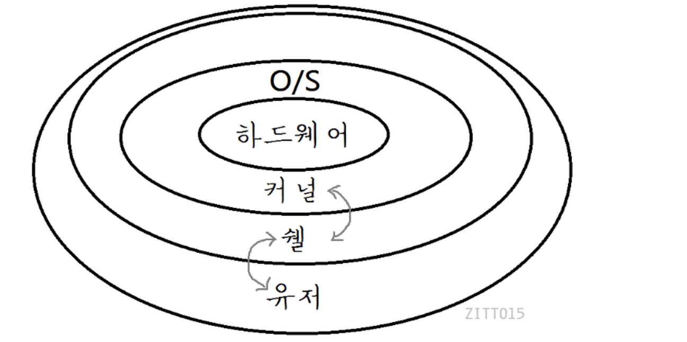

# UNIX

## Shell

### Shell 이란?

- **쉘(Shell)**은 커널과 사용자의 가운데에서 중간 다리 역할을 함(사용자 명령을 해석하여 커널에 전달, 커널이 명령을 수행)

  - 프로그램(: 기계어 명령어의 집합)은 DISK에 바이너리 코드(기계어)로 저장됨
    - 실행중인 프로그램(Program in excution) = 프로세스
    - 프로그램은 메모리에 올라가서 실행됨
  - 우리가 쉘에서 명령어를 입력하는 것은 결국 프로그램을 실행하는 것, 쉘 프로세스(Shell process) (ls도 결국 프로그램)
  - 쉘은 다른 프로그램을 띄우는 것
  - 프로세스는 라이프 사이클이 있음
    - 쉘이 부모 프로세스, ls는 자식 프로세스 
    - 컴퓨터를 딱 키면 최초의 조상 프로세스를 실행됨
    - 자식프로세스가 죽으면 부모 프로세스에게 죽는다고 알림, 부모가 자식 유품을 정리
  - **커널(Kernel)**은 운영 체제(OS)의 핵심 다양한 기능을 하고, 운영체제 맨 하부에서 돌아감
    - 하드웨어 자원을 자원이 필요한 프로세스에 나눠줌
    - 프로세스 제어(Task manager)
    - 프로그램이 OS에 요구하는 시스템 콜
    - 메모리 제어 등 다양한 기능 수행

  

- 유닉스 계열에서 사용되는 대화형 사용자 인터페이스를 쉘이라고 함

- 쉘은 3가지 역할을 함

  1. 대화식(Interactive) 사용
     - 사용자 요청을 기다리고, 사용자가 요청하면 즉시 결과 값을 출력해주는 대화형 구조를 가짐
  2. 프로그래밍
     - 복합적인 작업을 수행할 수 있도록 명령어를 묶어 사용 가능(→ 어짜피 순차적으로 실행되기 때문)
  3. 리눅스 세션(Session) 설정
     - 리눅스 환경을 자신이 원하는 상태로 세팅 가능

- 쉘의 종류는 다양함

  - sh, csh, bash, ksh, zsh 등 ... 

- **쉘 스크립트(Shell Script)**는 리눅스 시스템에서 지원하는 명령어들의 집합을 묶어서 프로그램화한 것

> 출처 : https://zitto15.tistory.com/10

### Shell 기본 명령어

* `pwd` : 현재 디렉토리 위치

* `ls` : 파일과 디렉토리 목록 보기

   - `ls *` : 폴더 안에 것도 모두 출력

   - 그 결과를 텍스트 파일로 보내버림

     ```bash
     ls * > result.txt
     ```

- `mkdir` : 새로운 디렉토리 생성

  ```bash
  mkdir project
  ```

* `cd` : 디렉토리 변경

  ```bash
  cd #홈 디렉토리로 이동
  cd . #현재 디렉토리로 이동
  cd .. #한 당계 상위 디렉토리로 이동
  cd / #최상위 디렉토리로 이동
  ```

* `cp` , `mv`, `rm` : 파일 복사, 이동, 삭제

  ```bash
  cp file1 file2 #파일1을 복사해서 파일2 생성
  cp file1 dir1/ #파일1을 디렉토리1 안에 복사
  cp file1 file2 dir1/ #파일1과 파일2를 디렉토리1 안에 복사
  cp -r dir1/ dir2/ #디렉토리1 전체를 복사(-r옵션은 리컬시브로 아래 하위도 전부 복사)
  ```

  ```bash
  mv file1 file2 #파일1을 파일2로 이름변경
  mv file1 dir1/ #파일1을 디렉토리1으로 이동
  mv file1 file2 dir1/ #파일1,2를 디렉토리1으로 이동
  mv dir1/ dir2/ #디렉토리1을 디렉토리2로 이름변경
  ```

  ```bash
  rm file1 #파일1을 삭제
  rm *.dat #.dat로 끝나는 파일 모두 삭제
  rm * #모든 파일 삭제
  rm -r dir1/ #디렉토리를 삭제 -r로 하위까지
  rm -rf dir1/ #경고 없이 강제 삭제
  rm -ri dir1/ #경고 있게 삭제
  ```

* `find` : 검색

  ```bash
  find #현재 디렉토리에 있는 숨겨진 하위 디렉토리 파일 모두 찾음
  find /dir #특정 디렉토리에 있는 파일을 검색
  find /dir -name "ssh" #특정 디렉토리에서 ssh들어간 파일 검색
  ```

* `touch` : 빈 파일(0바이트) 생성

* `echo` : 매개변수를 표준 출력으로 보내주는 명령어

  * 쉘 화면은 표준 출력이라 부름
  * 표준 출력 `0`, 표준 입력 `1`, 표준 에러 `2`

  ```bash
  echo "Hello world"
  >> Hello world
  ```

* `cat` : 표준 입력을 받아서 표준 출력으로 보내는 것

  - 해당 파일 내용을 표준 입력으로 파일로 리다이렉션 함

  ```bash
  cat > hello.txt
  >> hello
  >> hello
  ```

  - 해당 파일 내용을 표준 출력으로 보냄

  ```bash
  cat hello.txt
  >> hello2
  >> hello3
  ```

* `grep` : 표준 입력을 받아서 매개변수와 일치하는 것을 필터해서 표준 출력으로 보여줌

* `>` : 첫번째 명령을 다음 명령으로 리다이렉션 함

  ```bash
  echo "hello" > hello.txt
  cat hello.txt
  >> hello
  ```

  * 추가되는 것이 아니라 덮어씀

  ```bash
  echo "hello2" > hello.txt
  cat hello.txt
  >> hello2
  ```

* `>>` : 리다이렉션이 추가모드가 됨

  ```bash
  echo "hello" > hello.txt
  echo "hello2" >> hello.txt
  
  cat hello.txt
  >> hello
  >> hello2
  ```

* `|` : 앞 명령의 표준 출력을 뒷 명령의 표준 입력이 되는 것

  ```bash
  cat hello.txt | grep hello
  ```


## Vim의 기초

### vim 기본 명령어
* https://vim-adventures.com/에서 익힐 수 있음
* vimtutor로 충분히 익힐 수 있음
  ```bash
  vimtutor
  ```
#### 일반모드

* **방향키**  
  * `h` `j` `k` `l`: `←` `↓` `↑` `→`

* **삭제** : `x`
* **입력 모드** 
  * `i` : insert 모드로 됨
  * `a` : append 모드로 됨

* **명령 모드**
  * `:` : 로 접근 가능

#### 명령 모드

* 가능 명령어
  * `:w` : 저장
  * `:q` : 종료
  * `:q!` : 저장X 종료
  * `:wq!` : 저장O 종료

### Vim의 모드

* 일반모드, 입력모드, 명령모드, 비쥬얼 모드가 존재

  

